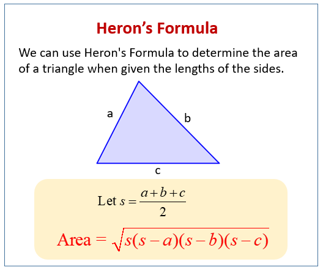

# Area of Triangle(Heron's formula)

In this program, the area of the triangle is calculated when three sides are given using Heron's formula.

You just need to input the sides of your triangle in comma-separated format.

Heron's formula:

